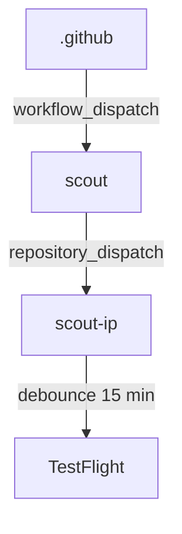

Shared [reusable workflows](https://docs.github.com/en/actions/sharing-automations/reusing-workflows) for kasianov-mikhail repositories.

## Update flow

## 🔧 Auto Fix

Runs Claude Code to diagnose a workflow failure and create a fix PR.

## 🔀 Resolve Conflicts

Finds open PRs with merge conflicts and runs Claude Code to resolve them.

## Required secrets

- `ANTHROPIC_API_KEY` — for Claude Code
- `GH_PAT` — personal access token with `repo` and `workflow` scopes
